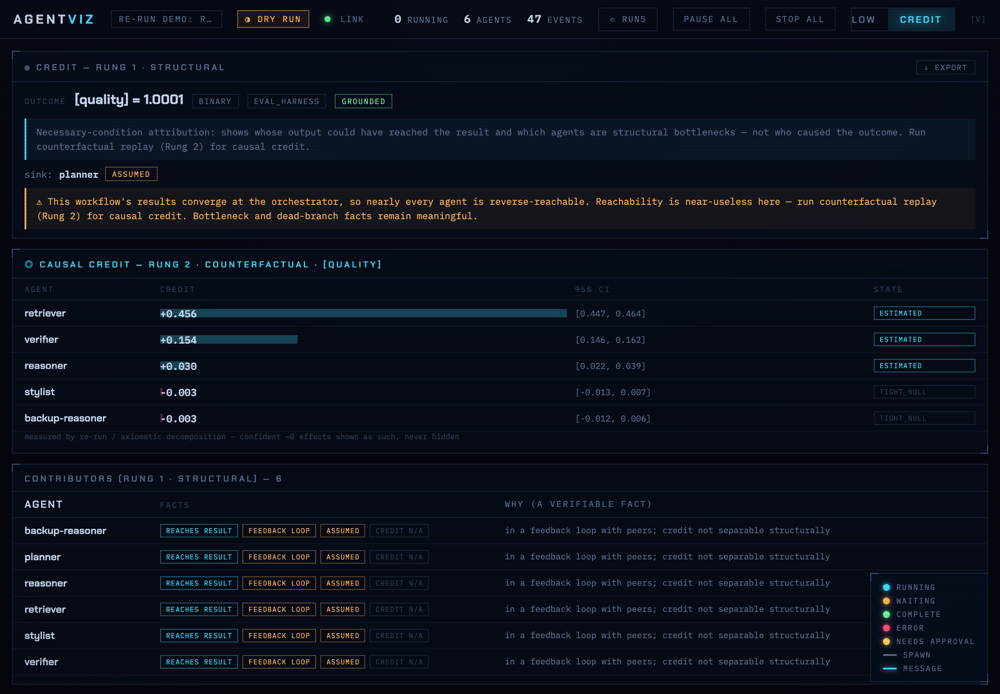

<div align="center">

# AgentViz

### Watch your agents think — as a live 3D world you can fly around.


*Agents are glowing nodes. Messages pulse along the edges. A tool call waiting on
your approval is an unmissable golden ring. Toggle to a clean 2D graph the moment
you need to actually debug.*

[Quickstart](#quickstart) · [The four views](#the-four-views) · [Credit assignment](#credit-assignment--which-agent-actually-mattered) · [LangGraph](#measure-credit-on-your-langgraph--no-hand-wrapping) · [CrewAI](#measure-credit-on-your-crewai-crew) · [Efficiency audit](#efficiency-audit) · [SDK](#sdk) · [How it works](#how-it-works)

</div>

---

## Why

Multi-agent systems are invisible. You launch an orchestrator, it spawns workers,
they message each other and call tools — and all you get is a wall of interleaved
log lines. AgentViz turns that stream into something you can **see**: a live world
where structure, timing, and stalls are obvious at a glance.

- **3D is the spectacle** — for demos, for wonder, for understanding shape.
- **2D is the instrument** — a stable graph for serious debugging.
- **FLOW is the story** — a swimlane transcript of who said what, in what order.
- **The audit is the verdict** — a rule-based efficiency score, never a vibe.
- **Credit assignment is the answer** — which agent actually earned the outcome, *measured*
  by re-running with it removed (counterfactual), never an LLM opinion.

Everything renders from a single event stream. Point any Python agents at it, or
drop `/agentviz` into a Claude Code session.

## Quickstart

Two minutes, zero config. Requires Python ≥ 3.11 and Node ≥ 18.

```bash
git clone https://github.com/amwine28/AgentViz.git
cd AgentViz

# install the SDK (editable)
pip install -e sdk

# build + launch the world (starts the relay, opens your browser),
# and fire a choreographed demo swarm so you see it move:
bash scripts/agentviz.sh --demo
```

Your browser opens to the live 3D world and a demo mission begins: three squads
spawn in waves, messages pulse between them, two tool calls wait for **your**
approval (golden rings — approve or deny them in the queue), and one rogue agent
fails dramatically in error-red.

Already have your own agents? See [SDK](#sdk) — it's one context manager.

### Run it as a desktop app + watch any terminal (macOS)

AgentViz is a multi-session, tabbed workspace: each terminal you opt in becomes
its own tab, streaming its **real** activity — a live Claude Code session if you
run `claude` there, otherwise the real commands you type. Nothing is shown for a
terminal you didn't opt in.

```bash
# one-time: define the `agentviz` command + build a double-clickable app
bash scripts/agentviz.sh install     # adds the `agentviz` command to ~/.zshrc
bash scripts/agentviz.sh app         # builds AgentViz.app onto your Desktop
```

Then double-click **AgentViz.app** (it opens a chromeless window to an empty
screen), and in any terminal you want to watch, run:

```bash
agentviz            # this terminal pops up as a tab; `agentviz off` to stop
```

## The four views

Switch any time with the toggle in the top bar, or press **`V`** to cycle.

| View | For | What you get |
|------|-----|--------------|
| **3D** | wonder, demos | Glowing status-colored nodes in space, message particles, pulsing approval rings, fly-to camera, bloom. |
| **2D** | debugging | Stable force graph. **Edge thickness = message volume, node size = activity.** Hub & bottleneck called out. |
| **FLOW** | causality | Swimlane sequence diagram — one lane per agent, spawn branches, labeled message arrows, tool marks. Noisy runs fold into expandable sections. |
| **Audit** | verdict | An efficiency score with itemized, fact-based findings (lives in the 2D panel). |

## Efficiency audit

Spawning more agents isn't free. AgentViz scores every run **0–100 (A–F)** — and
every point deducted traces to a *verifiable fact in the event stream*, never a
model's opinion:

- **Dead weight** — agents spawned that made no tool calls and sent no messages
  (could fewer agents do the job?)
- **Duplicate roles** — sibling agents that ran identical tool sets (merge candidates)
- **Token skew** — one agent burning >50% of tokens while producing <25% of outputs
- **Denied / timed-out tool calls** and **error exits** — requested work that never ran

Each finding names its rule, the agents involved, and the reason. The whole audit —
plus node feature vectors and weighted edges — exports in one click as
**NetworkX node-link JSON**:

```python
import json, networkx as nx
G = nx.node_link_graph(json.load(open("my-run.graph.json")))
# every agent run is now a graph dataset: feed it to NetworkX, PyTorch Geometric, anything.
```

## Credit assignment — which agent actually mattered?



Your swarm finishes and you get **one** verdict — tests passed, eval scored 0.9, user said 👍.
But *which agent earned it?* The one on the obvious path may have added nothing; a quiet one
may have been decisive. AgentViz answers this **grounded — every number is a measured fact or
an axiom, never an LLM "rate this agent 0–100" opinion**, and when the data can't tell, it says
so. Report an outcome and open the **CREDIT** lens. It's a ladder, cheap → rigorous:

- **Rung 1 — structural** *(live):* reverse-reachability + dominators over the handoff graph —
  *could* an agent's output even reach the result, and is it a structural bottleneck. Cheap;
  "necessary," not "caused." On real converging swarms it honestly says "reachability is
  near-useless here, run a counterfactual."
- **Rung 2 — counterfactual replay** *(live):* **re-run the workflow with an agent removed and
  measure how much the outcome drops.** That delta *is* its causal credit — with a confidence
  interval from repeated runs, not a fake point number. Every re-run is forced through a
  **dry-run safety layer** (adversarially audited, 0 leaks) that mocks real side effects, so
  measuring credit never sends a duplicate email or charges a card twice.
- **Rung 3 — Shapley** & **Rung 4 — densification** *(built):* fair credit under redundancy
  (two agents that cover each other), and spreading the sparse end-reward into per-step credit.

```python
from agentviz.rerun import measure_credit_by_rerun   # Rung 2, live
credit = measure_credit_by_rerun(my_workflow, ["retriever", "reasoner", "verifier"],
                                 samples=200, channel="answer_quality")
# -> retriever +0.45 [0.44,0.46] estimated · verifier +0.15 · reasoner +0.03 (redundant) ...
```

It even *measures redundancy*: if a reasoner and a backup-reasoner cover each other, each shows
small individual credit — discovered, not guessed. See [`docs/credit-assignment.md`](docs/credit-assignment.md).

## Measure credit on your LangGraph — no hand-wrapping

Already built a [LangGraph](https://github.com/langchain-ai/langgraph) pipeline? Point AgentViz at
the **same spec you already wrote** — your `nodes` dict and `edges` list — and get measured
counterfactual credit per node. No SDK wrapping, no reimplementation: the adapter turns your graph
into the re-run workflow the engine consumes, runs it with each node ablated, and measures the drop.

```python
from agentviz.integrations.langgraph import measure_langgraph_credit

NODES = {"retriever": retrieve, "reasoner": reason, "verifier": verify, "stylist": polish}
EDGES = [("retriever", "reasoner"), ("reasoner", "verifier"), ("verifier", "stylist")]
# ^ the same dict + list you pass to StateGraph.add_node / add_edge

credit = measure_langgraph_credit(
    NODES, EDGES,
    input={"question": "..."},
    reward=lambda final_state: float(final_state["eval_score"]),  # YOUR eval, the ground truth
    samples=200,
)
# retriever +0.45 [0.44,0.46] estimated · reasoner +0.30 · verifier +0.15 · stylist ~0.00 (tight_null)
```

A removed node's body genuinely never runs and it merges no state, so downstream nodes feel the real
consequence of its absence — that delta *is* the causal credit, not a guess. A node that does nothing
(the cosmetic `stylist` above) is surfaced as a confident **~0**, not hidden. Two runnable demos:
[`examples/langgraph_credit_demo.py`](examples/langgraph_credit_demo.py) (a linear pipeline) and
[`examples/langgraph_conditional_demo.py`](examples/langgraph_conditional_demo.py) (a **supervisor**
that routes to one of two specialists) — each builds a real LangGraph if it's installed, else measures
on the spec directly.

**Conditional routing works** (`add_conditional_edges`): a router runs on the live, possibly-ablated
state, so if removing a node deterministically reroutes the graph, that reroute is measured as the
**real consequence** of its absence — the honest counterfactual, not a held-fixed path. The un-taken
branch is correctly a confident ~0. (When that makes a node look superadditive — A worth 0.8, B worth
0.3, past a 0.8 total — that's real complementarity, which Shapley/Rung 3 deconflates, not a bug.)

**Cycles & retry loops work too.** A conditional edge that routes *back* to an earlier node
(`worker → check → (not done → worker, else END)`) makes the graph cyclic; the runner switches to a
bounded scheduler with a `max_steps` cap, so a re-run **can never hang** — and if removing a node
makes the loop run longer (or never converge), that's measured as the real consequence, with a capped
run reporting the genuine current-state reward, never a fabricated one.

**Honest scope:** any DAG *or* bounded-cyclic graph. Re-runs re-execute non-ablated node bodies, so
route real side effects through `tool_call(side_effect="external")` (mocked under the engine's forced
dry-run) or measure on a side-effect-free pipeline. Measuring causal credit costs real re-runs (and
real tokens) — the honest price of a measured answer over a guessed one.

## Measure credit on your CrewAI crew

Same idea, same honesty — for [CrewAI](https://github.com/crewAIInc/crewAI). A sequential crew is an
ordered list of tasks where each task's output becomes the next's context; AgentViz maps that to the
graph engine and measures each task's causal credit by re-running with it ablated:

```python
from agentviz.integrations.crewai import measure_crew_credit

TASKS = [("researcher", research), ("writer", write), ("editor", edit), ("proofreader", proof)]
#         ^ ordered (name, task_fn) — task_fn(context) -> partial update; for a real crew it wraps the agent call

credit = measure_crew_credit(TASKS, input={...}, reward=lambda ctx: ctx["eval_score"], samples=200)
# researcher +0.50 · writer +0.30 · editor +0.15 · proofreader ~0.00 (tight_null → prune candidate)
```

It **delegates to the same verified engine** (no re-implemented credit math), so the credit is the
same measured-delta-with-CI signal and feeds `recommend()` identically. `crew_topology(crew)`
duck-types a real `Crew` for the node names + order. Runnable in
[`examples/crewai_credit_demo.py`](examples/crewai_credit_demo.py). **Scope:** sequential process in
v1 (hierarchical/manager-delegation is the next step); you supply runnable `task_fn`s — the adapter
doesn't hook `crew.kickoff` internals (CrewAI exposes no public per-task ablation seam).

### From measurement to decision

A credit number is only useful if you act on it. `recommend()` turns the measured results into
concrete, **grounded** recommendations — every one traces to a measured fact (the confidence-interval
verdict, the CI, the cost), never an opinion:

```python
from agentviz.recommend import recommend, format_recommendations

recs = recommend(credit, cost_by_node=cost_per_run, total_reward=0.9, channel="answer_quality")
print(format_recommendations(recs))
# ▲ [prune_candidate] stylist (~$0.0060/run)
#   → Review 'stylist' for removal — contributes ~0 to answer_quality while costing $0.0060/run.
#     Verify it isn't needed for another objective, latency, or safety.
```

- **`prune_candidate`** — a `tight_null` node (confidently ~0), with the $/run you'd save.
- **`single_point_of_failure`** — a node whose measured contribution is most of the reward; harden it.
- **`regression`** — against a prior measurement, a node whose contribution *confidently* dropped
  (the CIs don't overlap — drops within noise are **not** flagged). A CI-gate for agent pipelines.
- **`increase_samples`** — where the signal is undetermined: don't act, measure more.

A healthy node yields **no** recommendation — silence means "nothing to act on," not "not analyzed."
And every action says *review / verify*, not *delete*: the measurement answers one reward channel,
so the human owns the call. (In the conditional demo, the un-taken `code_specialist` shows as a prune
candidate — and the caveat is exactly right: it's null on *this* query, essential for code queries.)

These surface **in the UI too**: `session.report_recommendations(recs)` publishes them, and the
**CREDIT** lens renders them as a severity-ranked action list above the causal-credit table — the
decision sits next to the measurement that justifies it. The LangGraph demos publish both, so an open
`/agentviz` window lights up with the credit *and* what to do about it.

## Replay a real Claude Code session

Already ran a multi-agent Claude Code session? Watch it play back — in 3D, FLOW, and
with a credit map — straight from its transcript, no instrumentation:

```bash
bash scripts/agentviz.sh --replay ~/.claude/projects/<encoded-cwd>/<sessionId>.jsonl --outcome=1
```

This reads the session's top-level JSONL plus its sub-agent sidechain transcripts,
reconstructs the spawn hierarchy and handoffs, and streams them into the live world.
`--outcome=1` attaches the terminal reward (you ran it, you know it passed) so the CREDIT
lens populates. Outcomes are always external — never guessed from the transcript.

On a real converging session (sub-agents reporting back to one orchestrator), the CREDIT
lens will honestly say *"results converge at the orchestrator — reachability is near-useless
here, run counterfactual replay for causal credit"* rather than fabricate per-agent numbers.
That honesty is the point.

## Ingest from OpenTelemetry (LangGraph, CrewAI, AutoGen, OpenAI Agents SDK…)

Any framework that emits OpenTelemetry GenAI spans (or OpenInference) can stream into
AgentViz — no SDK wrapping. Start the OTLP receiver and point your tracer's OTLP/HTTP
exporter at it:

```bash
cd relay && npm run otel-receiver        # listens on http://localhost:4318/v1/traces
# then set your app: OTEL_EXPORTER_OTLP_ENDPOINT=http://localhost:4318
```

The receiver translates spans into the same event stream (the nearest-enclosing-agent
walk over `parent_span_id` *is* the handoff DAG), so 3D / 2D / FLOW / CREDIT all work.
Token usage maps from `gen_ai.usage.*` (and deprecated/OpenInference names); cost is
taken from instrumentation when present, else derived from a versioned price table,
else reported as unknown — never guessed.

## SDK

Wrap any async Python agents. Emission is **fail-open** — a down or slow relay never
stalls or crashes your code; events buffer and reconnect on their own.

```python
import asyncio
from agentviz import session, ToolCallDenied

async def main():
    s = session(name="my-run")        # auto-discovers a running relay
    await s.connect()                 # auto-starts one if none

    async with s.agent("orchestrator") as orch:
        async with s.agent("worker", parent_id=orch.agent_id) as w:
            await w.log("starting work")

            # a tool call the human can approve/deny in the UI.
            # default policy: deny on timeout — never silently approved.
            result = await w.tool_call(
                name="fetch_data",
                args={"source": "api"},
                fn=lambda: {"rows": 42},
                approval_timeout=30,
            )

            await w.report_usage(input_tokens=1200, output_tokens=300,
                                 model="claude-sonnet-4-6", cost_usd=0.012)
            await s.send_message("worker", "orchestrator", "done")

asyncio.run(main())
```

Highlights: `agent.log()`, async tool functions, per-agent token/cost reporting,
and live control from the UI (pause / resume / stop / inject / approve / deny) with
sent → applied/failed acknowledgement.

### `/agentviz` in Claude Code

Copy the slash command into your Claude config so a session's agents appear with
no manual wrapping:

```bash
mkdir -p ~/.claude/commands && cp commands/agentviz.md ~/.claude/commands/
# then in Claude Code:  /agentviz        (or /agentviz demo)
```

## How it works

```
 your agents ──(SDK, fail-open)──▶  relay  ──(WebSocket fan-out)──▶  browser
   Python / Claude Code            (Node, ws)                       (React)
                                        │                               │
                                  50k ring buffer,              one store (reducer)
                                  session-scoped,                      │
                                  auto-port                  ┌─────────┼─────────┐
                                                            3D        2D / FLOW   audit
```

- **One store, four renderers.** A pure reducer over the event stream is the single
  source of truth. 3D (three.js / `3d-force-graph`), 2D (D3), FLOW (SVG), and the
  audit all derive from the same state — no renderer-specific state.
- **Reliability floor.** Per-agent sequence numbers (the UI shows *"N events dropped"*
  rather than rendering a wrong graph), a session-scoped buffer that survives a normal
  run, fail-open emission with bounded buffering and reconnect, and command
  acknowledgements.
- **Auto port.** The relay picks a free port and writes `~/.agentviz/relay.json`; the
  SDK and browser discover it. No hardcoded ports.

## Project layout

```
sdk/      Python SDK (session, agent, fail-open relay client, events)
relay/    Node WebSocket relay (fan-out, session buffer, command routing)
ui/       React app (store + 3D/2D/FLOW renderers, audit, graph export)
examples/ demo_swarm.py, basic_run.py, integration_test.py
scripts/  agentviz.sh launcher
```

## Development

```bash
cd sdk   && python3 -m pytest -q                              # SDK tests
cd relay && npm install && npm test                           # relay tests (jest)
cd ui    && npm install && npm run build && npx vitest run    # UI build + tests
python3 examples/integration_test.py                          # end-to-end, no browser
```

## Status & non-goals

A focused, working visualization-and-live-control tool — built to be an
*interesting project that works*, not infrastructure to depend on. Not in scope:
auth, billing, hosted/SaaS, long-term persistence, or fleet-scale durability.

## License

[MIT](LICENSE) © 2026 Aaron Winegrad
